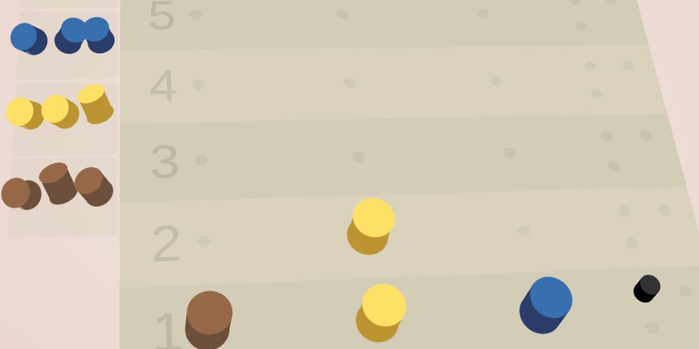

# Master Mind Solver

> Solve any Master Mind game from your pocket. Helpful to repeatedly beat your friend at this game.

- [game](https://platane.github.io/mm/game)
- [solver](https://platane.github.io/mm/solver)

# Table of Contents

- [Install](#install)
- [Usage](#usage)
- [Older versions](#older-versions)
- [License](#license)

# Install

`yarn`

# Usage

`yarn dev`

# Older versions

- [v1](https://youthful-chickens.surge.sh)

# License

[MIT](./LICENSE)
